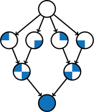

= Começando Concorrente: Uma Introdução Gentil à Programação Concorrente 
Barry Wittman <wittman1@otterbein.edu>; Tim Korb <jtk@purdue.edu>; Aditya Mathur <apm@purdue.edu>
:doctype: book
:source-highlighter: rouge
:rouge-style: default
:icons: font
:stem: latexmath
:xrefstyle: short
:listing-caption: Program
:google-analytics-account: G-VEDGKRPMMK

ifdef::ebook-format[:leveloffset: -1]

== Disponibilidade

[.text-center]

Esta é uma versão traduzida do texto __Start Concurrent__ publicado originalmente e disponível em 
link:http://www.thepress.purdue.edu/titles/format/9781626710092[Purdue University Press^] ou
link:https://www.amazon.com/Start-Concurrent-Introduction-Problem-Concurrency/dp/1626710090[Amazon^],
além disso o texto também está disponível na íntegra em HTML para leitura em um navegador web.
A versão HTML está disponível como um documento único (o que permite uma pesquisa fácil) e dividida 
num documento separado para cada capítulo (o que reduz o tempo de carregamento). Clique em um __link__ 
abaixo para acessar à versão pretendida.

* link:full/index.html[HTML (documento único)]
* link:chunked/index.html[HTML (dividido)]

== Está utilizando __Começando Concorrente__?

Se já utiliza o __Começando Concorrente__ na sua sala de aula, conte pra gente!  Por favor, envie um e-mail para wittman1@otterbein.edu
e diga-nos em que disciplina utiliza o livro.  Se algumas alterações ao livro tornarem a sua aula mais fácil de lecionar, gostaríamos de
saber quais são.

== Nos ajude!

.Atualizações recentes!
[WARNING]
====
Fizemos algumas atualizações (Junho 2023) recentes, principalmente para atender aos requisitos do Google Analytics.  Se você notar algum erro ou formatação incomum, nos informe!
====

Nós apreciamos seus comentários e sugestões!
Por favor envie como uma 
link:https://github.com/start-concurrent/start-concurrent.github.io/issues[Github issue^]
ou (para os corajosos) copie o 
link:https://github.com/start-concurrent/start-concurrent.github.io[repositório Github^],
faça alterações no código fonte e submeta um __pull request__.

== Sobre

Bem-vindo ao __Começando Concorrente__!
Este livro foi concebido como um ponto de entrada para o desafiador domínio da 
computação multicore. Ele foi projetado para apresentar aos alunos a programação 
concorrente ao mesmo tempo em que eles aprendem os fundamentos da programação 
sequencial, no início da faculdade. Depois de dominar os conceitos abordados 
aqui, os alunos devem estar preparados quando se depararem com formas mais 
complexas de concorrência em cursos avançados e no local de trabalho. Uma 
geração de alunos que aprende a concorrência em seu primeiro curso estará pronta 
para explorar todo o poder dos chips com vários núcleos quando ingressar no mercado 
de trabalho.

Os processadores multicore são onipresentes. Quer você use um desktop, um laptop ou 
até mesmo um smartphone, é bem provável que seu computador tenha um chip multicore 
em seu coração. Computadores paralelos de baixo custo foram profetizados durante anos. 
Esse momento chegou. Os computadores paralelos estão em nossas mãos e em nossos bolsos. 
Esse progresso na tecnologia de microprocessadores lançou um desafio aos educadores: __Como 
podemos ensinar programação simultânea?__

A programação de computadores tem sido ensinada no meio acadêmico há décadas. No 
entanto, o objetivo não escrito em quase todas as aulas de programação para iniciantes 
tem sido ensinar os alunos a escrever, compilar, testar e depurar programas *sequenciais*. 
O material relacionado à programação simultânea geralmente é deixado para cursos sobre 
sistemas operacionais e linguagens de programação ou cursos de computação de alto 
desempenho. Agora que os computadores paralelos estão em toda parte, devemos considerar 
introduzir os fundamentos da programação simultânea em aulas para iniciantes em programação?

De nossa parte, acreditamos que a programação simultânea pode e deve ser ensinada aos alunos 
do primeiro ano. Este livro tem como objetivo apresentar a programação concorrente praticamente 
desde o primeiro dia. A justificativa para nossa crença deriva de outra crença de que o pensamento 
processual, tanto sequencial quanto concorrente, é natural. As pessoas sabiam como resolver 
problemas de maneira sequencial, muito antes de o estudo de algoritmos se tornar um disciplina 
formal e a ciência da computação um curso formal. E essa lógica se aplica à solução de problemas 
usando um conjunto de soluções sequenciais aplicadas simultaneamente. Observe um cozinheiro na 
cozinha e você verá a simultaneidade em ação. Assista a um filme e você verá a simultaneidade em 
ação à medida que várias subtramas, cenas e flashbacks história. Os pais usam soluções simultâneas 
para resolver problemas cotidianos enquanto lidam com os cuidados com os filhos, a carreira e a 
vida social.

Se as pessoas resolvem naturalmente os problemas de forma sequencial e simultânea, por que 
precisamos ensinar programação? A programação é uma maneira de mapear uma solução algorítmica 
de um problema em uma linguagem artificial, como Java. É uma atividade que requer análise 
formal, vocabulário especializado e lógica afiada. A verdadeira substância intelectual da 
programação está nesse processo de mapeamento. Qual é a melhor maneira de transformar uma 
solução sequencial em uma linguagem artificial? Como uma solução sequencial pode ser dividida 
em partes simultâneas que são executadas mais rapidamente do que a original? Como um problema 
grande problema pode ser dividido em partes pequenas e gerenciáveis que podem ser programadas 
separadamente e depois integrados em um todo? Além disso, há questões de testes, depuração, 
documentação e gerenciamento do processo de desenvolvimento de software, que se combinam para 
tornar a programação um campo ilimitado para o esforço intelectual.

=== Público alvo

Este livro foi concebido para ensinar estudantes de nível universitário sem experiência em 
programação em um período de dois semestres. Embora comecemos com conceitos de concorrência 
desde o início, é difícil para os alunos sem experiência prévia em programação escrever 
programas multithread úteis até o final do primeiro semestre.  No entanto, ao final do 
segundo semestre, este livro pode levar o aluno de uma folha em branco a um programador 
capaz de programas paralelos complexos que exploram o poder dos processadores com vários núcleos.

O conteúdo deste livro também pode ser usado em cursos de um único semestre. Os capítulos 1 
a 12 são destinados ao iniciante absoluto. Se você não quiser introduzir a programação simultânea 
em um primeiro curso, esses capítulos devem ser adequados. O material e os exercícios sobre 
concorrência nesses capítulos podem ser ignorados sem afetar negativamente o outro material. Em 
um segundo curso de programação, os Capítulos 1 a 12 devem ser usados como material de revisão, bem 
como uma introdução à programação simultânea. A maior parte do material dos Capítulos 13 em diante 
poderia ser abordada em um único semestre.

=== Material abordado

Java é uma linguagem complexa. Sua longa lista de recursos torna difícil para 
um instrutor decidir o que abordar e o que deixar de fora. Muitas vezes, há 
uma tendência de cobrir mais material do que menos. Percebemos que o aluno de 
hoje usa não apenas um livro didático, mas também o grande volume de material 
disponível na Web para aprender qualquer assunto, inclusive programação. 
Consequentemente, nosso foco está mais nos elementos fundamentais da programação 
e menos em fornecer uma descrição completa do Java, que ainda é uma linguagem 
viva e em evolução. Quando apropriado, direcionamos o aluno para sites onde é 
possível encontrar material de referência relevante.

Classes e objetos são uma parte essencial do Java. Alguns educadores adotaram a 
abordagem “objetos desde cedo”, que se concentra fortemente nos princípios orientados 
a objetos desde o início. Embora vejamos muitos méritos nessa abordagem, nos sentimos 
compelidos a começar com lógica, aritmética e fluxo de controle para que os alunos 
tenham uma base sólida do que colocar dentro de seus objetos. Um tratamento completo 
de classes e objetos se desenvolve ao longo do livro, passando naturalmente de programas 
monolíticos para a decomposição em métodos e para a orientação total a objetos.

=== Organização

O material abordado pode ser dividido de diferentes maneiras, dependendo das necessidades 
do instrutor ou do aluno. Os capítulos 1 a 12, com exceção do capítulo 7, foram criados 
para apresentar ao aluno o Java e a programação em geral. Os capítulos 7 e 15 abrangem o 
material relacionado às interfaces gráficas de usuário e podem ser ignorados se esses 
tópicos não forem de interesse. Os Capítulos 13 e 14 apresentam um tratamento detalhado 
dos recursos de concorrência do Java. Embora façamos um esforço para marcar o material 
sobre concorrência e mantê-lo independente do restante do conteúdo, os capítulos numerados 
a partir do 15 pressupõem algum conhecimento e interesse em concorrência. O próprio 
capítulo 15 aborda a depuração e os testes, o que é ainda mais crucial em um ambiente 
simultâneo. O restante do livro aborda material avançado relacionado a design de OO, 
estruturas de dados e E/S.

=== Resumo dos capítulos

Uma característica deste livro que o diferencia de muitos livros-texto de Java é 
sua abordagem orientada a problemas. A maioria dos capítulos é dividida nas seguintes partes.

Problema:: Um problema motivador é apresentado no início de quase todos os 
capítulos. Esse problema tem o objetivo de mostrar o valor do material abordado 
no capítulo, além de esboçar uma aplicação prática.

Conceitos:: Em cada capítulo, há uma ou mais seções curtas dedicadas a conceitos. 
Os conceitos descritos nessas seções são os tópicos fundamentais abordados no 
capítulo, bem como as principais ideias necessárias para resolver o problema 
motivador do capítulo. A intenção é que esses conceitos sejam amplos e neutros 
em termos de linguagem. A sintaxe Java é mantida em um mínimo absoluto nessas seções.

Sintaxe:: Cada capítulo tem uma ou mais seções que descrevem a sintaxe Java 
necessária para implementar os conceitos já descritos nas seções Conceitos. Essas 
seções geralmente são mais longas e têm exemplos numerados em código Java 
espalhados por toda parte.

Solution:: Após a apresentação dos conceitos apropriados e da sintaxe Java necessários 
para resolver o problema motivador, uma solução é fornecida perto do final do capítulo. 
Dessa forma, os alunos têm tempo suficiente para pensar sobre a abordagem necessária 
para resolver o problema antes que a resposta seja dada.

Concorrência:: Em todos os capítulos, exceto nos Capítulos 13 e 14, os capítulos dedicados 
à concorrência, os conceitos e a sintaxe de concorrência relevantes adicionais são 
introduzidos nessas seções especialmente marcadas, disseminando a concorrência por todo o livro.

Exercícios:: Cada capítulo termina com exercícios, que são divididos em três seções: Problemas 
conceituais, Prática de programação e Experimentos. A maioria dos problemas conceituais é 
simples e tem como objetivo testar rapidamente a compreensão do aluno. Os problemas de 
prática de programação exigem que os alunos implementem um pequeno programa em Java e podem 
ser usados como tarefas de casa. Os experimentos são um recurso especial deste livro-texto e 
são especialmente apropriados no contexto da concorrência. Os experimentos se concentram no 
desempenho de um programa, geralmente em termos de velocidade ou uso de memória. Os alunos 
precisarão executar programas curtos e medir seu tempo de execução ou outros recursos, obtendo 
uma visão prática do aumento de velocidade e de outras vantagens e desafios da simultaneidade. 
Referências a exercícios são fornecidas ao longo do texto do capítulo.

Esperamos que a estruturação dos capítulos dessa forma possa ser útil para muitos tipos diferentes 
de leitores. Os programadores iniciantes talvez queiram ler cada capítulo do início ao fim. 
Programadores experientes que nunca programaram em Java podem se concentrar principalmente nas 
seções de *Sintaxe* para aprender a sintaxe e a semântica apropriadas do Java. Os programadores 
Java mais experientes podem preferir se concentrar nos exemplos e exercícios claramente numerados. 
Obviamente, os instrutores são incentivados a usar os problemas motivadores para motivar suas aulas também.

Além disso, as seções *Armadilhas* especialmente marcadas ao longo do livro destacam erros e falhas 
comuns de programação.

=== O que esse livro não cobre?

Este livro não tem a intenção de ser um guia abrangente de Java. Em vez disso, ele 
pretende ensinar como usar os computadores para resolver problemas, especialmente 
de forma simultânea. O Java tem uma riqueza maravilhosa de pacotes e bibliotecas 
que não temos espaço para cobrir. Por exemplo, o pacote Swing para criar interfaces 
de usuário é discutido, mas não em sua totalidade. Para o material não encontrado 
neste livro, esperamos que os alunos consultem o material disponível no site de 
link:http://download.oracle.com/javase/tutorial[tutorial do Oracle Java] e em outros 
livros e sites de referência.

=== Sugestões

IDE Java:: É importante que os alunos sejam apresentados a uma IDE Java logo no 
início do curso. Recomendamos que os alunos usem uma IDE mais simples em vez de 
uma mais complexo. Usamos com sucesso o DrJava, embora outras IDEs simples possam 
funcionar igualmente bem. Para os instrutores que desejam que seus alunos tenham 
experiência com uma IDE de nível industrial, damos exemplos de uso do Eclipse e 
do DrJava no capítulo sobre teste e depuração e em algumas outras ocasiões, quando 
relevante.
Concorrência desde o começo:: Muitos cursos começam com uma ou duas aulas sobre 
a relação entre a solução de problemas e os computadores. O Capítulo 2 aborda 
esse tópico. Durante essas primeiras aulas, os instrutores podem introduzir as 
noções de soluções sequenciais e concorrentes. Pode-se usar problemas simples 
de áreas como matemática ou física ou até mesmo do cotidiano que levem a soluções 
sequenciais e concorrentes. A exposição precoce a soluções desses problemas, 
programadas em Java, pode ser benéfica para os alunos, mesmo que eles não 
entendam toda a sintaxe.
Entrada e saída:: A questão de qual material de Entrada e Saída (E/S) deve ser 
abordado pode ser tratada de várias maneiras. Embora a programação de GUIs 
atraentes possa ser empolgante, alguns instrutores preferem adiar o tratamento 
detalhado do material relacionado à GUI até o final do curso. Neste livro, decidimos 
seguir uma abordagem flexível. Começamos discutindo o uso de `System.out.print()` e 
`Scanner` e a classe `JOptionPane` como alternativas para entrada e saída básicas. 
Nossa suposição é de que a maioria dos instrutores preferirá a simplicidade da E/S 
de linha de comando; no entanto, aqueles que preferem uma abordagem mais pesada de 
GUI podem começar logo no Capítulo 7, para obter noções básicas de GUI, e 
eventualmente passar para o Capítulo 15, para se aprofundar em GUIs e Swing. Os 
instrutores que desejarem se concentrar apenas na E/S de linha de comando podem 
ignorar esses capítulos.

== Agradecimentos

Várias pessoas tiveram um papel importante na motivação dos autores para a 
tarefa de escrever este livro e na escolha dos tópicos. Primeiro, durante a 
primavera de 2008, vários professores do Departamento de Ciência da Computação 
e um cientista do ITaP de Purdue participaram das primeiras discussões 
relacionadas ao ensino de programação simultânea em turmas de calouros. Apesar 
do grande número de questões levantadas, todos os participantes pareciam 
concordar em um ponto: que devemos introduzir a simultaneidade no início do 
currículo de graduação em Ciência da Computação. Agradecemos a todos os 
participantes, destacamos Buster Dunsmore, Ananth Grama, Suresh Jagannathan, 
Sunil Prabhakar, Faisal Saied e Jan Vitek. Nós nos beneficiamos com a 
orientação, o incentivo e o apoio de vários ex-alunos e parceiros corporativos; 
agradecimentos especiais a Kevin Kahn, Andrew Chien e Carl Murray.

A number of people have played a significant role in motivating the authors to undertake the task of writing this book and in the choice of topics. First, during the spring of 2008, several faculty from the Department of Computer Science and a scientist from Purdue's ITaP, participated in early discussions related to the teaching of concurrent programming in freshman classes. Despite the multitude of issues raised, all participants seemed to agree on one point: that we ought to introduce concurrency early in the Computer Science undergraduate curriculum. Thanks to all the participants, namely, Buster Dunsmore, Ananth Grama, Suresh Jagannathan, Sunil Prabhakar, Faisal Saied, and Jan Vitek.  We benefited from advice, encouragement, and support from a number of alumni and corporate partners; special thanks to Kevin Kahn, Andrew Chien, and Carl Murray.

Agradecemos aos vários revisores anônimos que leram cuidadosamente a versão 3.0 
deste manuscrito e fizeram sugestões valiosas. Esta versão atual não existiria 
sem as muitas sugestões e críticas desses revisores.

No outono de 2008, oferecemos uma aula experimental para calouros intitulada 
“Introdução à Programação com Concorrência”. Essa aula foi certamente uma das 
melhores que já ministramos para calouros. Agradecemos a Alexander Bartol, 
Alexander Coe, Eric Fisher, Benjamin Gilliland-Sauer, John Graff, Tyler Holzer, 
Kelly, Jordan Kelly, Azfar Khandoker, Zackary Naas, Ravi Pareek, Carl Rhodes, 
Robert Schwalm, Andrew Wirtz e Christopher Womble.

Agradecimentos especiais a Azfar Khandoker, que não apenas participou dessa 
aula inicial, mas também trabalhou em um projeto de estudo independente para 
criar exercícios usando robôs Lego para ajudar os alunos a aprender programação. 
O trabalho de Azfar levou ao uso de robôs em duas aulas de programação para 
calouros ministradas em Purdue.

Agradecemos o apoio e a cooperação do corpo docente e de seus alunos, que são 
nossos primeiros usuários de teste: Professor David John, da Wake Forest 
University, e Professor Sunil Prabhakar, da Purdue University.

Por fim, agradecemos a todos da comunidade de código aberto que enviaram problemas, perguntas ou solicitações pull por meio do link:https://github.com/[Github^].
